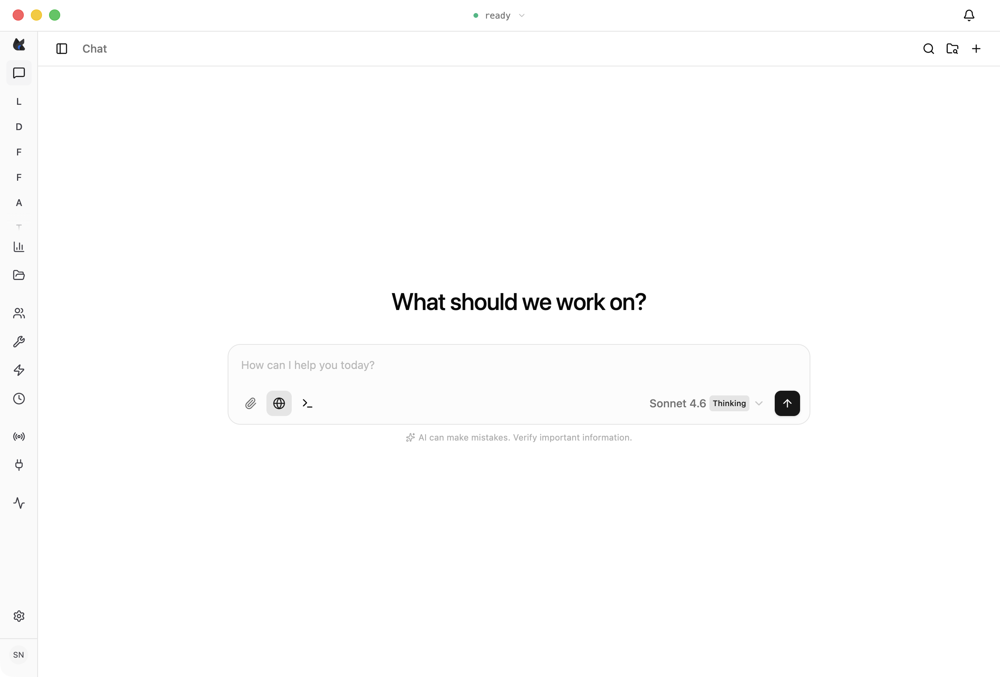

  

<h1 align="center">Foxl</h1>

<strong>Your 24/7 personal AI agent for macOS and Windows.</strong>

  Lives in your menu bar. Drives your real Chrome, writes and runs code, manages files, spawns parallel subagents, and runs scheduled automations while you sleep — powered by Claude Opus 4.7 and Sonnet 4.6, or your own API keys.

  
  
  
  
  

  

## Download

| Platform | Notes | Download |
|---|---|---|
| **macOS** | Universal (Apple Silicon + Intel), macOS 12+ | [Foxl-latest-universal.dmg](https://github.com/foxl-ai/foxl/releases/latest/download/Foxl-latest-universal.dmg) |
| **Windows** | Signed installer, Windows 10+ | [Foxl-latest-setup.exe](https://github.com/foxl-ai/foxl/releases/latest/download/Foxl-latest-setup.exe) |
| **Windows Portable** | No install, Windows 10+ | [Foxl-latest-portable.zip](https://github.com/foxl-ai/foxl/releases/latest/download/Foxl-latest-portable.zip) |
| **Web** | Any modern browser | [app.foxl.ai](https://app.foxl.ai) |

## Highlights

- Lives in the menu bar. One click from recent chats. Runs 24/7 in the background.
- Drives your real Chrome — cookies, logins, extensions, 2FA intact.
- Curated, file-backed memory that grows with every conversation.
- Cron, heartbeat, and webhook schedules. Daily briefings, nightly backups, weekly audits.
- Up to five parallel subagents. Auto-continuation synthesizes results.
- Claude Opus 4.7 and Sonnet 4.6 with adaptive extended thinking.
- BYOK: Anthropic, OpenAI, Google Gemini, Ollama, Claude Pro/Max, ChatGPT Plus.
- Universal macOS build, signed Windows installers, electron-updater auto-update.

## Documentation

Full docs at [docs.foxl.ai](https://docs.foxl.ai/docs): [Download](https://docs.foxl.ai/docs/getting-started/download), [Models](https://docs.foxl.ai/docs/models), [Providers](https://docs.foxl.ai/docs/providers), [Tools](https://docs.foxl.ai/docs/tools), [Skills](https://docs.foxl.ai/docs/skills), [Sub-agents](https://docs.foxl.ai/docs/subagents), [Scheduling](https://docs.foxl.ai/docs/scheduling), [Memory](https://docs.foxl.ai/docs/memory), [Credits](https://docs.foxl.ai/docs/account/credits), [FAQ](https://docs.foxl.ai/docs/faq).

## Community

[Discord](https://discord.gg/6J53VyV2Fy) · [Issues](https://github.com/foxl-ai/foxl/issues) · [Changelog](https://foxl.ai/#changelog) · [Blog](https://foxl.ai/blog)

## Security

Found something? Email [security@foxl.ai](mailto:security@foxl.ai) or open a [private security advisory](https://github.com/foxl-ai/foxl/security/advisories/new).

## License

Proprietary software. See [LICENSE](LICENSE). Released binaries only; the agent runtime, relay, and web apps are developed in a private monorepo.
