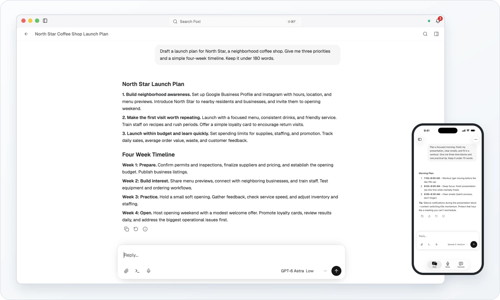
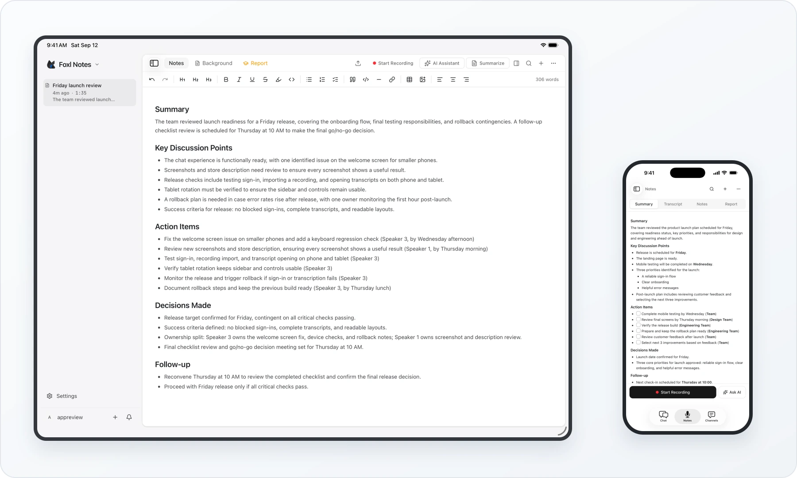

  

<h1 align="center">Foxl</h1>

  <strong>Your day. A little lighter.</strong> 
  A personal AI agent for research, writing, and everyday work. 
  At home on your desktop. Ready on your phone.

  <a href="#get-started"><strong>Download Foxl</strong></a> &nbsp;·&nbsp;
  <a href="https://foxl.ai">Website</a> &nbsp;·&nbsp;
  <a href="https://docs.foxl.ai/docs">Documentation</a> &nbsp;·&nbsp;
  <a href="https://foxl.ai/changelog">Changelog</a>

  

  <a href="https://foxl.ai/demos/first-screen/desktop-chat.mp4">
    <picture>
      <source media="(prefers-color-scheme: dark)" srcset="assets/readme/desktop-dark.webp" />
      
    </picture>
  </a>

A thought becomes a plan. Real screens from Foxl Desktop and iPhone. <a href="https://foxl.ai/demos/first-screen/desktop-chat.mp4">Watch the Desktop demo ↗</a>

Foxl brings conversation, files, browser tools, and meeting notes into one calm workspace. Start with something on your mind. Leave with a clearer plan, a useful draft, or work you can pick up again later.

On Desktop, your agent runs on your computer. Connect the models you choose, decide which actions need approval, and keep useful context in memory you can inspect.

## Get started

| Platform | Download or open |
| :--- | :--- |
| **macOS** | [Universal DMG — Apple silicon + Intel][download-macos] |
| **Windows** | [Installer][download-windows] · [Portable ZIP][download-windows-portable] |
| **Linux** | [AppImage][download-linux] |
| **iPhone & iPad** | [Public TestFlight beta][download-ios] |
| **Android** | [APK — direct download][download-android] |
| **Web** | [Open Foxl in your browser][open-web] |

iOS and iPadOS are available through TestFlight. Android uses an APK that you install directly. [Installation help](https://docs.foxl.ai/docs/get-started/download) · [All releases](https://github.com/foxl-ai/foxl/releases)

On Desktop, getting to your first useful conversation takes three steps:

1. **Open Foxl.** Install the app for your computer.
2. **Choose your model.** Connect a supported subscription, add a provider API key, or select a local model.
3. **Bring a small task.** Ask a question, work through an idea, or give your agent a file to help with.

> “Draft a launch plan for a neighborhood coffee shop. Give me three priorities and a simple four-week timeline.”

Foxl Desktop is free to download. Your chosen model or transcription provider may charge for its service.

## The ideas behind Foxl

Good software should leave you more room for the work that matters. These principles guide how we build Foxl.

### Make room for attention.

Clear type, generous spacing, and focused views make a conversation easier to follow. A familiar workspace gives research, writing, and tools a place to live, with detail available as the work calls for it.

### Keep you in control.

You choose the model and the permissions. Approval controls and visible progress let you understand what your agent is doing and decide how much freedom to give it.

### Let context carry forward.

A useful conversation should help with the next one. Saved memory gives your agent context to draw on, and Desktop Notes can connect a meeting to earlier chats. That memory stays readable and editable as plain Markdown.

### Respect your choices.

Bring an account you already use, choose a provider, or run a model on your own hardware. Work with ordinary files and inspectable memory. The setup should fit the way you work.

## Built around your work

### Desktop · Think it through. Put it to work.

Research a question, shape an idea, or find the words for a first draft. When the task needs more, your agent can work with local files, use your browser, and run commands with the permissions you choose.

- **A workspace for the result.** Keep conversations and the files you are working on close together.
- **Tools for the next step.** Extend your agent with skills, connect services, and schedule recurring work.
- **Your choice of models.** Move between providers within the same familiar interface.

[Explore Desktop](https://docs.foxl.ai/docs/desktop) · [Set up your browser](https://docs.foxl.ai/docs/get-started/chrome-extension)

### Notes · Keep the conversation.

Record a conversation, follow its transcript, and turn it into a summary and action items you can return to. On Desktop, Notes can use saved memories and look up earlier chats, bringing useful context into your next meeting.

  <a href="https://foxl.ai/notes">
    <picture>
      <source media="(prefers-color-scheme: dark)" srcset="assets/readme/notes-dark.webp" />
      
    </picture>
  </a>

A conversation becomes something you can come back to. Foxl Notes on iPad and iPhone.

[Meet Foxl Notes](https://foxl.ai/notes) · [Read the Notes guide](https://docs.foxl.ai/docs/notes)

### Code · Give the task some room.

Delegate coding work to agents and review the results in a browser. Foxl Code is a separate cloud service, currently in **private beta** with a waitlist.

[Explore Foxl Code and join the waitlist](https://foxl.ai/code)

## Your models. Your agents. Your keys.

Foxl Desktop supports three ways to connect a model:

| Connection | Examples |
| :--- | :--- |
| **Subscription sign-in** | Claude Pro / Max and ChatGPT Plus / Pro through their supported CLI sign-ins; Gemini CLI credentials |
| **Provider API key** | Anthropic, OpenAI, Google, Amazon Bedrock, and OpenAI-compatible providers |
| **Local inference** | Ollama, LM Studio, and vLLM on your own hardware |

Available models and usage limits depend on your provider and account. The [provider setup guide](https://docs.foxl.ai/docs/desktop/providers) covers the current integrations and connection steps.

## Your data and permissions

**Desktop storage is local.** Conversations, workspace files, and agent memory live on your computer. You can read, edit, or delete the Markdown files used for memory.

**Connected providers process what you send them.** Cloud models, transcription providers, and connected services have their own data flows. Desktop also supports local models and local transcription.

**Remote access is optional.** Connect your phone or browser to your Desktop through the Foxl relay when you need your computer's tools. The relay documentation explains the transport protections and data flows for each feature.

[Security & privacy](https://foxl.ai/security) · [Desktop relay](https://docs.foxl.ai/docs/get-started/desktop-relay) · [Privacy policy](https://foxl.ai/privacy)

## Find your way around

- **[Getting started](https://docs.foxl.ai/docs/get-started)** — installation, your first conversation, and connecting devices.
- **[Desktop guide](https://docs.foxl.ai/docs/desktop)** — providers, tools, skills, memory, and scheduling.
- **[Notes guide](https://docs.foxl.ai/docs/notes)** — recording, transcription, summaries, and meeting context.
- **[Changelog](https://foxl.ai/changelog)** — what changed in each release.
- **[Blog](https://foxl.ai/blog)** — product decisions and the engineering behind them.

## Feedback and security

[Get help or share feedback](https://foxl.ai/support) · [Join Discord](https://discord.gg/6J53VyV2Fy)

For a bug report, include your Foxl version, operating system, and steps to reproduce it. Clear examples help us understand what you were trying to do.

For security issues, contact [security@foxl.ai](mailto:security@foxl.ai) privately.

## About this repository

This is Foxl's public repository for **releases and downloads**. The application source is maintained separately. Feedback is welcome through the support and community links above.

Foxl is proprietary software. See the [license](LICENSE) and [terms](https://foxl.ai/terms).

© 2026 Foxl AI · Made in San Francisco.

[download-macos]: https://github.com/foxl-ai/foxl/releases/latest/download/Foxl-latest-universal.dmg
[download-windows]: https://github.com/foxl-ai/foxl/releases/latest/download/Foxl-latest-setup.exe
[download-windows-portable]: https://github.com/foxl-ai/foxl/releases/latest/download/Foxl-latest-portable.zip
[download-linux]: https://github.com/foxl-ai/foxl/releases/latest/download/Foxl-latest.AppImage
[download-android]: https://github.com/foxl-ai/foxl/releases/latest/download/Foxl-latest.apk
[download-ios]: https://testflight.apple.com/join/VpG4EK19
[open-web]: https://app.foxl.ai
