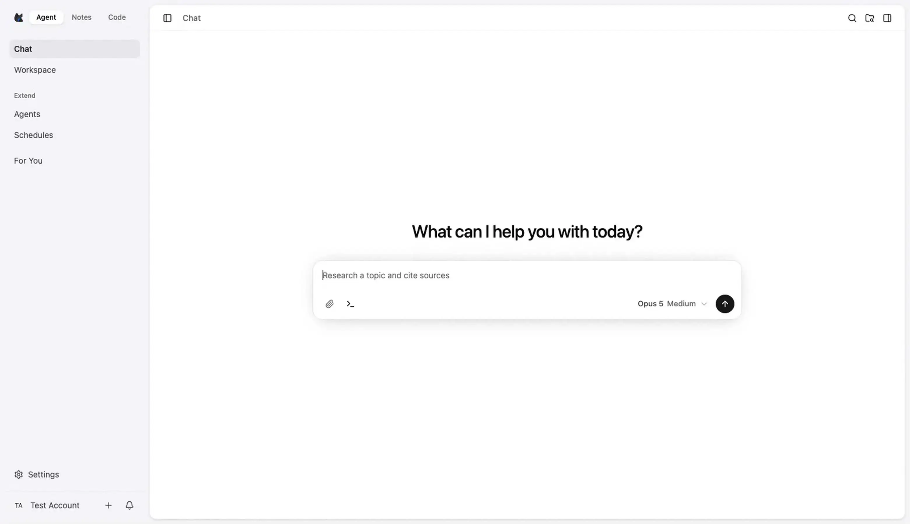

<p align="center">
  
</p>

<h1 align="center">Foxl</h1>

<p align="center"><strong>Your personal AI agent for macOS, Windows, Linux, Android, web and iOS TestFlight.</strong></p>

<p align="center">
  Ask for an outcome, get the finished work. Foxl sits in your menu bar, drives a
  real Chrome, writes and runs code, reads and writes your files, and keeps
  working on a schedule while you are away.
</p>

<p align="center">
  <a href="https://github.com/foxl-ai/foxl/releases/latest"></a>
  <a href="https://github.com/foxl-ai/foxl/releases/latest/download/Foxl-latest-universal.dmg"></a>
  <a href="https://github.com/foxl-ai/foxl/releases/latest/download/Foxl-latest-setup.exe"></a>
  <a href="https://github.com/foxl-ai/foxl/releases/latest/download/Foxl-latest.AppImage"></a>
  <a href="https://github.com/foxl-ai/foxl/releases/latest/download/Foxl-latest.apk"></a>
  <a href="https://docs.foxl.ai/docs/get-started/mobile"></a>
  <a href="https://discord.gg/6J53VyV2Fy"></a>
  <a href="https://foxl.ai"></a>
</p>

<!--
  THE HERO. One prompt, real tool calls, and the file the agent wrote opened
  back inside the app. Recorded from the shipped build at native Retina
  3120x1800.

  The visible hero is the animated WebP, because GitHub renders an  from a
  relative path and does not play a <video> from one. The MP4 is linked instead
  of embedded: an absolute https URL in a <video> tag does not autoplay on
  GitHub either, and only a video attached to a GitHub comment (the
  user-attachments host) plays inline.

  TO GET AN INLINE PLAYER (optional, one manual step): drag
  assets/desktop-hero.mp4 into any issue or PR comment on this repository, then
  replace the <a></a> block below with the URL GitHub returns:

    <video src="https://github.com/user-attachments/assets/PASTE-ID-HERE"
           poster="assets/desktop-hero-poster.webp" width="100%"
           autoplay loop muted playsinline>
      
    </video>

  Do not reuse an older attachment URL without checking it: the one this README
  carried before answered HTTP 404 and rendered an empty player.
-->
<p align="center">
  <a href="https://foxl.ai/foxl-desktop-hero.mp4">
    
  </a>
</p>
<p align="center"><sub>One sentence in, a finished presentation out. Recorded from the shipped build with real tool calls. <a href="https://foxl.ai/foxl-desktop-hero.mp4">Watch the full demo</a> (MP4, 38 seconds, 3120x1800).</sub></p>

## Download

| Platform | Notes | Download |
|---|---|---|
| **macOS** | Universal (Apple Silicon + Intel), macOS 12+ | [Foxl-latest-universal.dmg](https://github.com/foxl-ai/foxl/releases/latest/download/Foxl-latest-universal.dmg) |
| **Windows** | Signed NSIS installer, Windows 10+ (64-bit) | [Foxl-latest-setup.exe](https://github.com/foxl-ai/foxl/releases/latest/download/Foxl-latest-setup.exe) |
| **Windows Portable** | No install, Windows 10+ (64-bit) | [Foxl-latest-portable.zip](https://github.com/foxl-ai/foxl/releases/latest/download/Foxl-latest-portable.zip) |
| **Linux** | AppImage, one executable file, no package manager | [Foxl-latest.AppImage](https://github.com/foxl-ai/foxl/releases/latest/download/Foxl-latest.AppImage) |
| **Android** | Signed APK sideload while the Play Store listing is in review | [Foxl-latest.apk](https://github.com/foxl-ai/foxl/releases/latest/download/Foxl-latest.apk) |
| **Web** | Any modern browser | [app.foxl.ai](https://app.foxl.ai) |
| **iOS** | Internal TestFlight beta; no public App Store download yet | [Mobile app status](https://docs.foxl.ai/docs/get-started/mobile) |

Those filenames are fixed across releases, so the links keep working. macOS and
Windows update themselves in place through electron-updater. Android asks you to
allow installs from this source, because the APK is a direct download rather
than a store install. Every published build is also on the
[releases page](https://github.com/foxl-ai/foxl/releases) under its version
number.

Open the app, sign in or add your own API key, and ask for something real.

## How it works

1. Tell Foxl the outcome you want: "summarize this quarter's numbers into a
   one-pager", "watch this folder and file the invoices", "check what broke in
   CI overnight".
2. It plans the steps and works across your files, your terminal, and a real
   browser session.
3. The consequential steps stop for you first. Shell commands, terminal
   sessions, `git commit` and `git push`, and spawning a subagent all wait for
   your approval, and you can grant a pattern once instead of every time.
4. You get the deliverable: a file, a commit, a booked calendar, a drafted reply.

```text
┌─────────────────────────────────────────────────┐
│               Foxl desktop app                  │  menu bar + window
├─────────────────────────────────────────────────┤
│          local agent server (Node.js)           │  engine · tools · skills
├───────────────┬────────────────┬────────────────┤
│  your files   │  a real Chrome │  your model    │  runs on your machine,
│  & terminal   │  session       │  or your keys  │  with your credentials
└───────────────┴────────────────┴────────────────┘
```

## Highlights

- **Sits in the menu bar.** One click from recent chats, running in the
  background around the clock. Settings > General > Show in menu bar turns the
  icon off if you would rather it stayed out of the way.
- **Drives real Chrome.** With the bundled Chrome extension the agent works in
  your own browser, so cookies, logins, extensions and 2FA stay intact on the
  sites you are already signed in to. Without the extension it drives a separate
  Foxl browser profile that keeps its own logins.
- **Produces files, not just answers.** Documents, spreadsheets, reports and
  code land in a workspace you can open, edit and share.
- **Runs on a schedule.** Three trigger kinds, cron, heartbeat interval and
  webhook, for daily briefings, nightly backups and weekly audits.
- **Reachable from your chat apps.** Mention the bot in Slack and the work runs
  on your desktop with your local tools, then comes back as a reply in the same
  thread. Telegram, Discord, WhatsApp, Signal, Matrix and email connect the same
  way. Slack uses Socket Mode, so there is no public URL and no inbound port,
  and the allowed-channel list gates which channels can start work.
- **Parallel subagents.** Up to five at once, and when the last one finishes the
  server synthesizes the batch into one answer without you asking again.
- **34 bundled skills**, plus your own, covering browser automation, code
  search, research, document generation, email, calendars and more.
- **Curated, file-backed memory** that grows with every conversation and stays
  readable on disk as plain markdown.
- **Frontier models, or your own keys.** Claude Opus 5 is the default, with
  Fable 5, Opus 4.8, Sonnet 5, Haiku 4.5 and OpenAI's GPT-5.6 Sol, Terra and
  Luna alongside it. Adaptive extended thinking, prompt caching, and up to a
  million tokens of context on the current models.

## Models

Opus 5 is the default. The picker shows the current lineup and hides superseded
generations such as Opus 4.7, Opus 4.6 and Sonnet 4.6 behind a "show older
models" toggle, so they stay selectable without cluttering the list.

| Model | Context | Max output |
|---|---|---|
| **Claude Opus 5** (default) | 1M | 128K |
| Claude Fable 5 | 1M | 128K |
| Claude Opus 4.8 | 1M | 128K |
| Claude Sonnet 5 | 1M | 128K |
| Claude Haiku 4.5 | 200K | 64K |
| GPT-5.6 Sol / Terra / Luna | 1M | 128K |
| GPT-5.5 | 272K | 128K |

The GPT-5.6 models moved from 272K to the full million in v0.5.12, so a whole
repository or a long contract fits in one request. GPT-5.5 stays at 272K, and a
GPT model reached through a ChatGPT subscription serves 272K as well, because
that is OpenAI's own endpoint rather than Bedrock.

## Bring your own model

Use Foxl's included model access, or point the app at an account you already
pay for. Two different things are supported, and they work differently:

**API keys (BYOK).** Anthropic, OpenAI, Google AI, AWS Bedrock with your own AWS
credentials, and a local model through Ollama. On top of those, any
OpenAI-compatible endpoint: Groq, DeepSeek, OpenRouter, Together AI, Mistral,
Fireworks, Z.ai, Kimi, Qwen, MiniMax, Perplexity, xAI, Cerebras, SambaNova,
Cohere, AI21, HuggingFace, plus vLLM and LM Studio for models you host yourself.

**Subscription sign-ins, no API key.** A **Claude Pro or Max** subscription
through Claude Code's OAuth credentials, and a **ChatGPT Plus or Pro**
subscription through Codex OAuth. These are logins rather than metered API keys,
so an existing subscription counts and no new billing does.

## Privacy

The agent runs on your machine. Conversations, memory, skills and workspace
files live under `~/.foxl` on your own disk. API keys are stored encrypted with
AES-256-GCM in the local database rather than in plaintext. The browser the
extension drives is your own profile, on your own machine. Model traffic goes to
whichever provider you choose.

## Documentation

Full docs at [docs.foxl.ai](https://docs.foxl.ai/docs):

- [Get started](https://docs.foxl.ai/docs/get-started) including
  [Download](https://docs.foxl.ai/docs/get-started/download),
  [Chrome extension](https://docs.foxl.ai/docs/get-started/chrome-extension),
  [Web app](https://docs.foxl.ai/docs/get-started/web-app),
  [Mobile](https://docs.foxl.ai/docs/get-started/mobile) and
  [Desktop relay](https://docs.foxl.ai/docs/get-started/desktop-relay)
- [Desktop](https://docs.foxl.ai/docs/desktop) for models, providers, tools,
  skills, subagents, scheduling, memory, browser and channels
- [Foxl Code](https://docs.foxl.ai/docs/foxl-code), the autonomous coding agents
- [Notes](https://docs.foxl.ai/docs/notes), meeting recording and AI summaries
- [Reference](https://docs.foxl.ai/docs/reference) including
  [Credits](https://docs.foxl.ai/docs/reference/credits) and
  [Notifications](https://docs.foxl.ai/docs/reference/notifications)

## Community

[Discord](https://discord.gg/6J53VyV2Fy) ·
[Issues](https://github.com/foxl-ai/foxl/issues) ·
[Changelog](https://foxl.ai/#changelog) ·
[Blog](https://foxl.ai/blog)

Bug reports and feature requests are welcome in
[Issues](https://github.com/foxl-ai/foxl/issues). This repository hosts the
released binaries. The agent runtime, relay and web apps are developed in a
private monorepo, so it does not take code contributions.

## Security

Found something? Email [security@foxl.ai](mailto:security@foxl.ai) or open a
[private security advisory](https://github.com/foxl-ai/foxl/security/advisories/new).

## License

Proprietary. Copyright (c) 2026 Foxl AI, all rights reserved. See
[LICENSE](LICENSE). Downloading and using the released binaries is permitted
under that license; the source is not distributed, so there is nothing here to
build from source.
